## 🔎 프로젝트 소개  

위 프로젝트는 다음과 같은 배경에서 진행되었습니다.

- 책을 읽으면서 인상 깊었던 문장이나 느낀 점들을 기록하고 싶었지만, 노트나 메모장 앱은 체계적으로 관리하기 어렵다는 불편을 느낌.
- 많은 사람들이 책을 읽고도 기록하지 않아 금방 잊어버리는 경우가 많기 때문에 이를 해결하고자 함. 
- 독서 경험을 ‘나만의 기록’으로 남길 수 있는 공간이 있으면 좋을 것 같음.


<br>

### 1. 프로젝트 기간
 **2025.07.02 ~ 2024.09.04**

<br>

### 2. 포함 내용
1. 프로젝트 소개
2. 사용 기술 스택
3. 서비스 구조,화면,기능
4. 디렉토리 구조 및 패키지 역할
5. API 구조
6. 기술적 이슈 및 해결 과정
7. 관련 논문
8. 프로젝트 팀원 및 역할
   
<br>

## 🔧 사용 기술 스택

### Frontend
- Flutter 3.32.2
 
### Tools
- GitHub


<br>

## 🚀 서비스 화면 및 기능

### 로그인 및 회원가입 화면
<p align="center">
    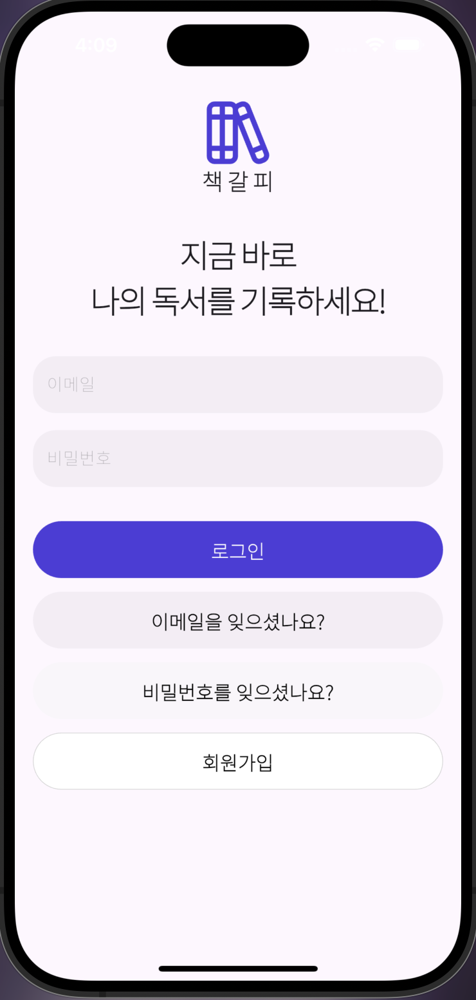
    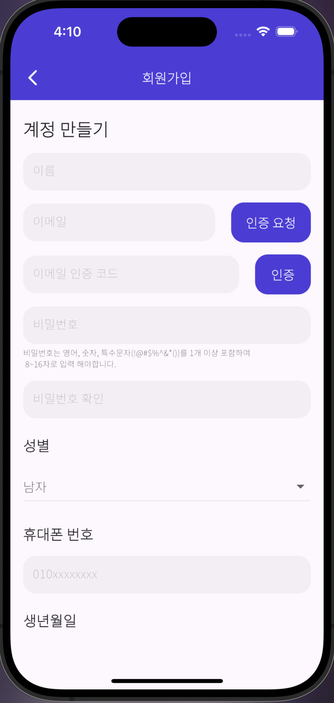
</p>

1. 사용자는 이메일, 비밀번호를 이용해 본 서비스에 로그인 할 수 있습니다.
2. 회원가입 버튼을 누르게 되면 회원가입 페이지로 연결되고 사용자는 이곳에서 계정을 생성할 수 있습니다.
3. 계정을 생성할 때는 이메일 인증을 통해 본인 인증 과정을 진행해야 합니다.


<br>

### 이메일 비밀번호 찾기 화면
<p align="center">
    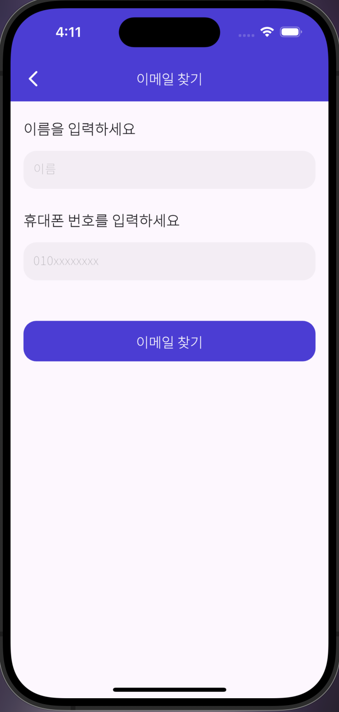
    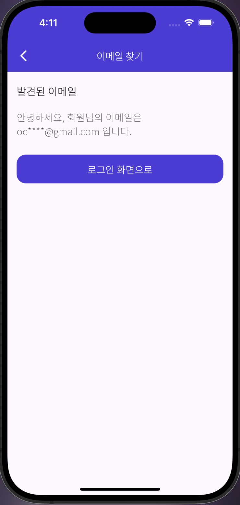
    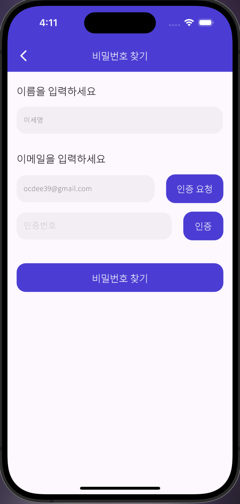
    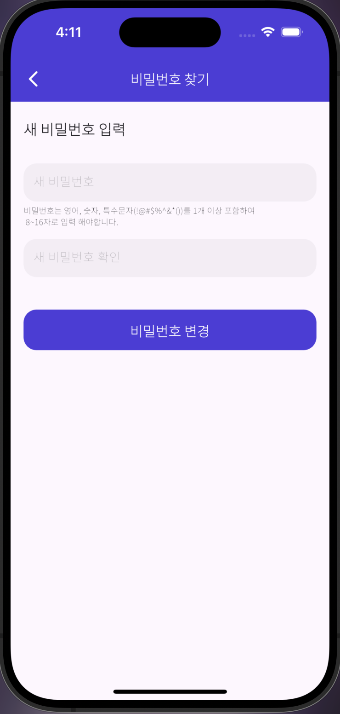
</p>

1. 사용자는 이름과 휴대폰 번호를 입력하면 해당 번호로 가입한 이메일 계정을 찾을 수 있다.
2. 이메일 계정은 개인 정보 보호를 위해 일부가 마스킹 된 형태로 보여준다.
3. 사용자는 이름을 입력하고, 이메일 인증을 진행하면 비밀번호를 변경할 수 있다.
4. 새 비밀번호를 입력하고 변경 버튼을 누르면 비밀번호가 변경된다.

<br>

### 홈 화면
<p align="center">
    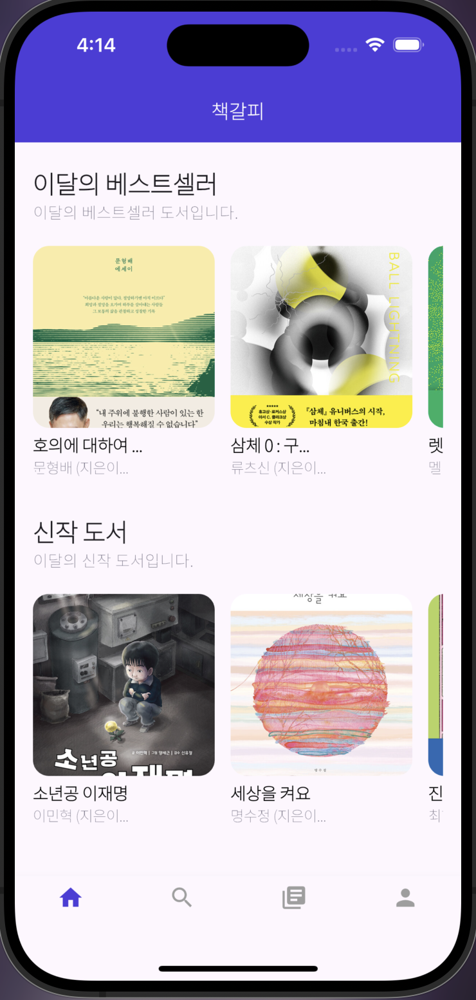
    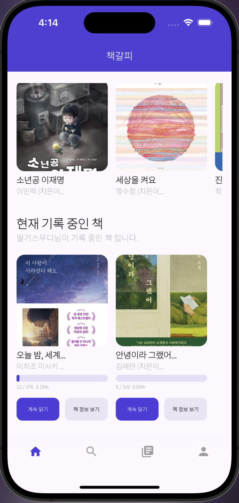
</p>

1. 사용자는 홈 화면에서 이달의 베스트셀러 도서 목록과 신작 도서 목록을 확인할 수 있다.
2. 도서 사진을 누르면 해당 도서에 대한 더 자세한 정보를 확인할 수 있다.
3. 사용자는 현재 기록 중인 책의 목록을 확인할 수 있다.
 - 계속 읽기 버튼을 누르면 독서 기록 페이지로 이동하고, 책 정보 보기 버튼을 누르면 해당 도서에 대한 더 자세한 정보를 확인할 수 있다.

<br>

### 도서 찾기 화면
<p align="center">
    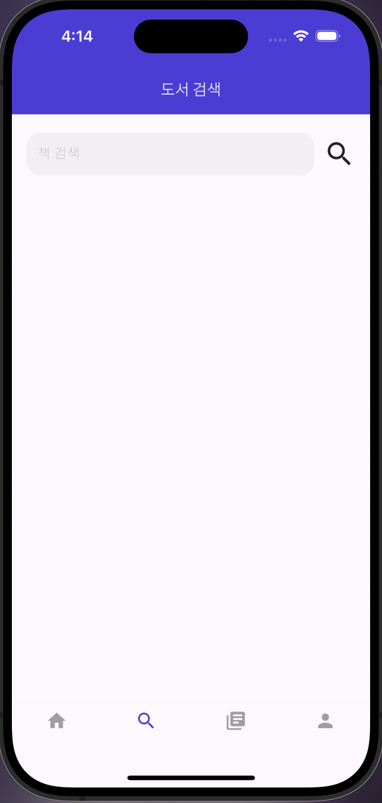
    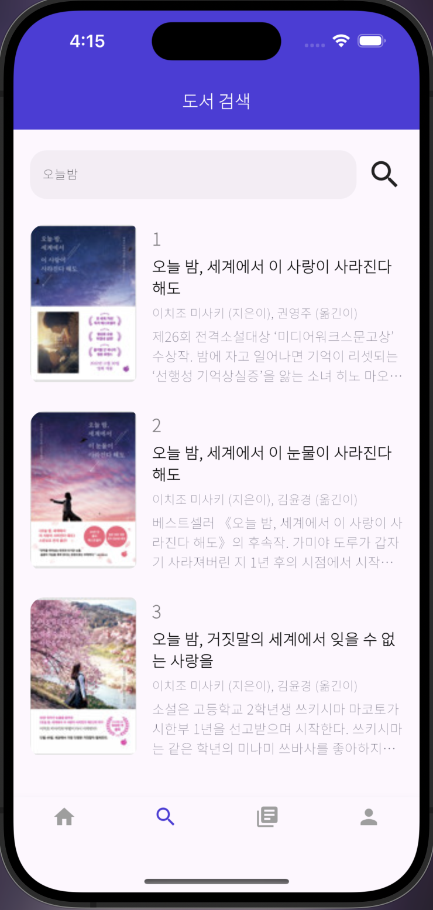
</p>

1. 사용자는 위 페이지에서 원하는 검색어를 입력하여 검색어에 해당하는 도서를 찾을 수 있다. 
2. 도서를 클릭하면 도서 상세 보기 페이지로 이동된다.

<br>

### 기록 독서 리스트 화면
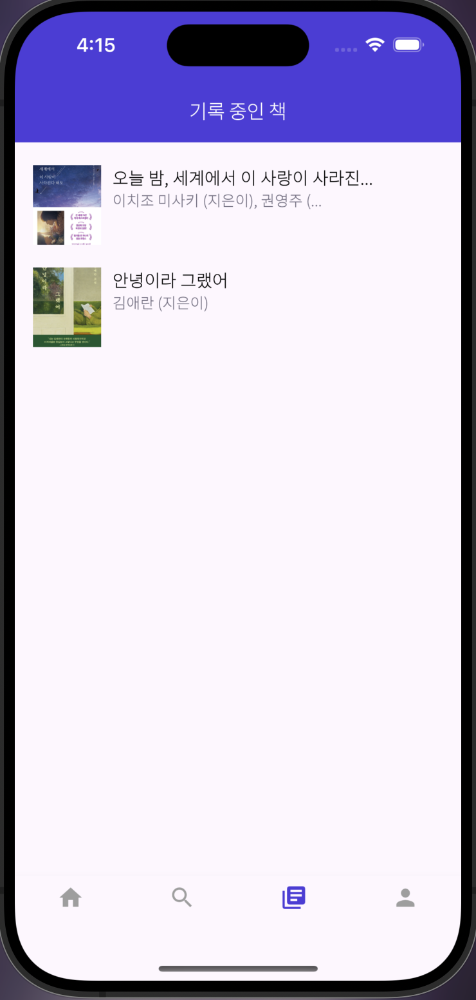

1. 사용자는 해당 페이지에서 현재 기록 중인 독서 리스트를 확인할 수 있다. 클릭할 시 해당 도서 기록 페이지로 이동된다.

<br>

### 마이페이지 화면
<p align="center">
    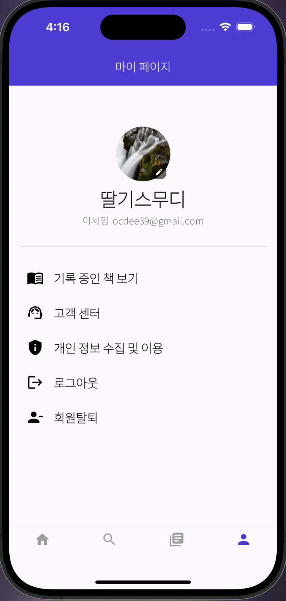
    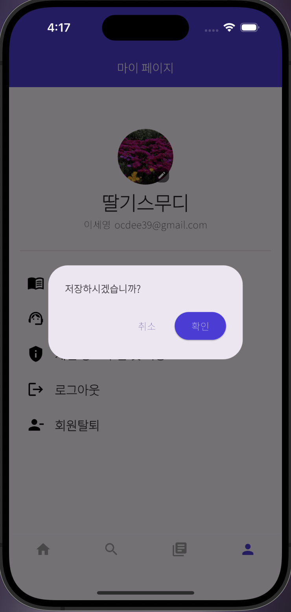
</p>

1. 사용자는 마이 페이지에서 사용자의 정보를 확인할 수 있다.
2. 프로필 사진을 누르면 프로필 사진으로 지정할 사진을 선택할 수 있고, 저장 메시지에 확인 버튼을 누르면 프로필 사진으로 지정된다.

<br>

### 독서 기록 화면
<p align="center">
    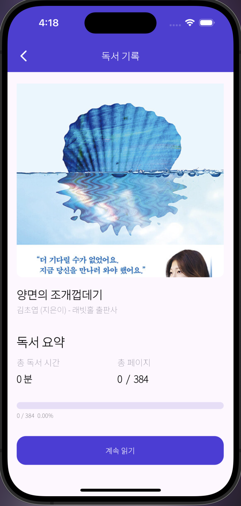
</p>

1. 사용자는 해당 페이지에서 독서 기록에 관한 정보를 확인할 수 있다.
2. 계속 읽기 버튼을 누르면 독서를 할 수 있는 페이지로 이동된다.

<br>

### 독서 및 기록 화면
<p align="center">
    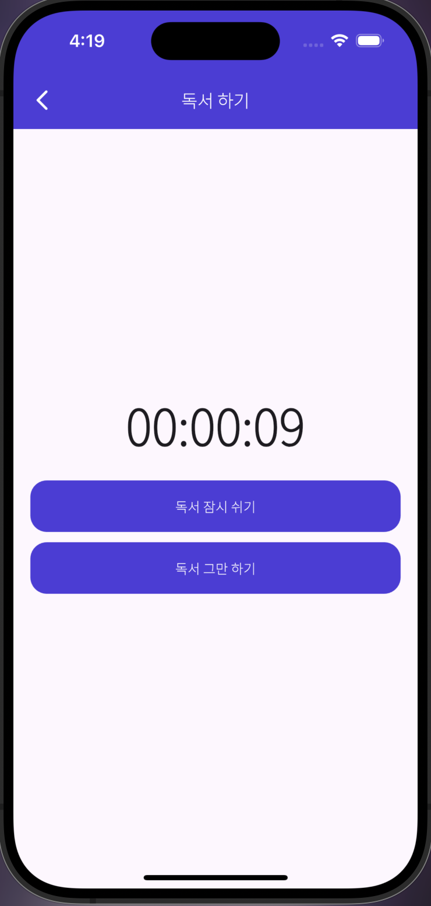
    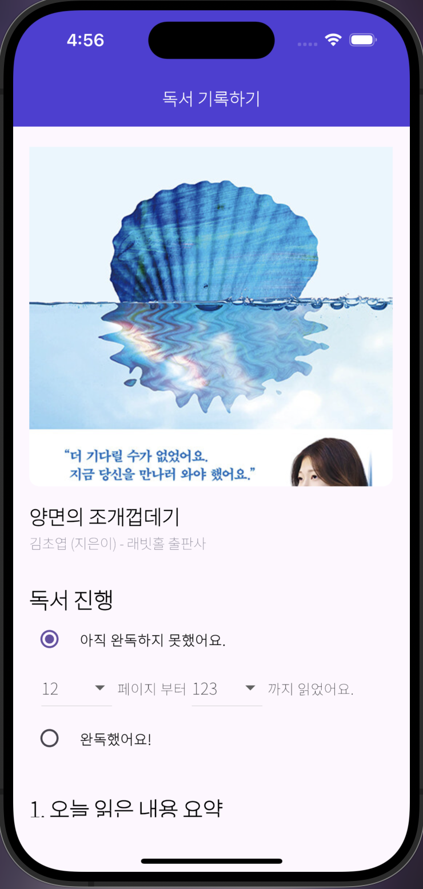
    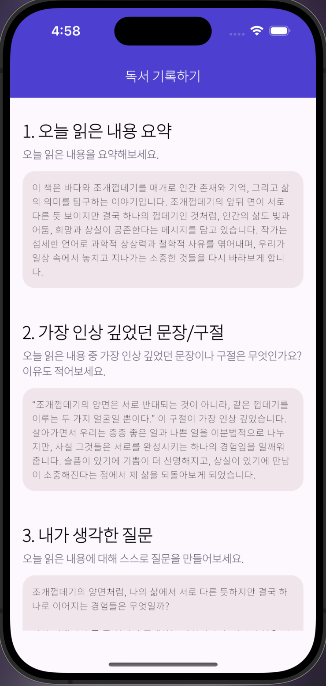
    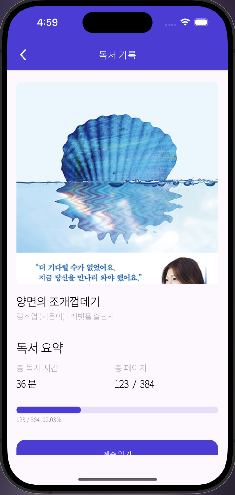
</p>

1. 사용자는 해당 페이지에서 독서 활동을 할 수 있다.
2. 독서 활동이 끝나게 되면 몇 페이지부터 몇 페이지 까지 읽었는지 독서 진행 상황을 드롭박스로 선택할 수 있고, 질문에 대한 답변을 통해 오늘 독서에 대한 기록을 할 수 있다.  
3. 모두 기록한 뒤 기록하기 버튼을 누르면 기록이 된다.
4. 독서 활동이 기록되면 마지막 화면과 같이 독서를 한 내용이 반영이 된다.

<br>

### 독서 기록 확인 및 완독 화면
<p align="center">
    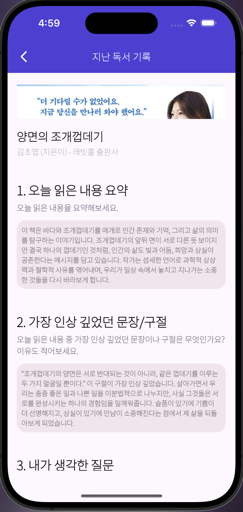
    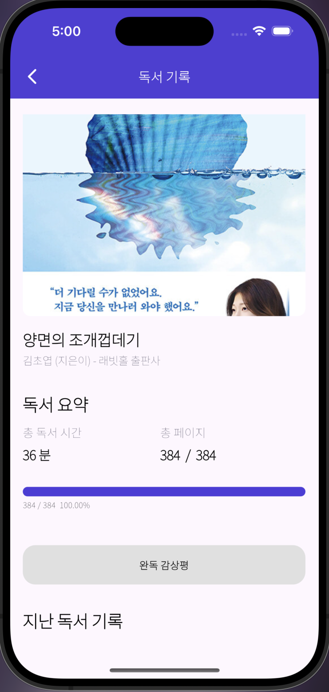
    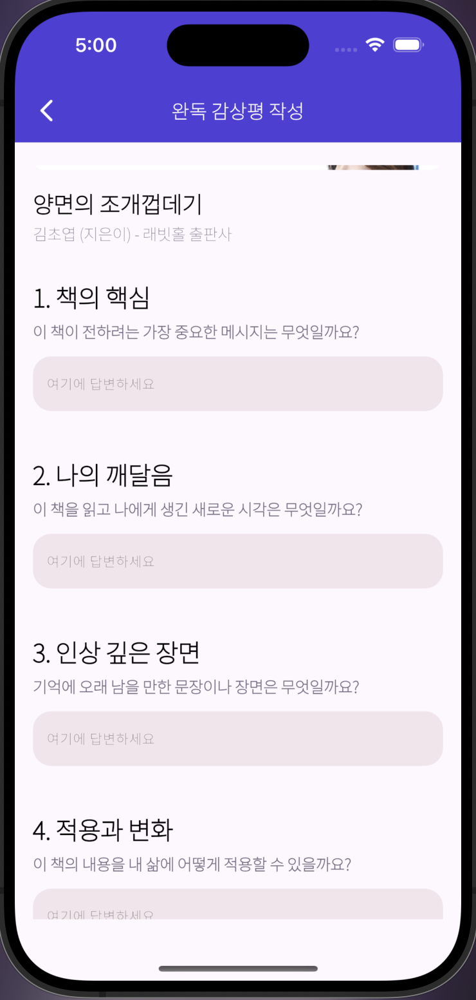
</p>

1. 사용자는 독서 기록 화면에서 지난 독서에서 기록했던 내용들을 확인할 수 있다.
2. 독서를 완독하게 된다면 위 화면과 같이 완독 감상평이라는 버튼이 생긴다.
3. 완독 감상평 버튼을 누르게 된다면 완독에 대한 감상평을 기록할 수 있고, 기존 독서 기록에 대한 질문들보다 더 다양한 질문들이 있기 때문에 더 깊이 있게 기록을 할 수 있다.

<br>

## 📂 디렉토리 구조 및 패키지 역할
### 백엔드 디렉토리
```
root
 ┣ myhomework
 ┃ ┣ complexKey
 ┃ ┃ ┣ MemberComplexKey.java
 ┃ ┃ ┣ ProblemPlagiarizeListPK.java
 ┃ ┃ ┗ ProblemSimilarityListPK.java
 ┃ ┣ controller
 ┃ ┃ ┣ MemberApiController.java
 ┃ ┃ ┣ MemberController.java
 ┃ ┃ ┣ ProblemApiController.java
 ┃ ┃ ┣ ProblemPlagiarizeListController.java
 ┃ ┃ ┣ ProblemSimilarityListController.java
 ┃ ┃ ┗ UserBalanceApiController.java
 ┃ ┣ dto
 ┃ ┃ ┣ DealForm.java
 ┃ ┃ ┣ FileForm.java
 ┃ ┃ ┣ MemberForm.java
 ┃ ┃ ┣ ProblemForm.java
 ┃ ┃ ┣ ProblemPlagiarizeListForm.java
 ┃ ┃ ┣ ProblemSimilarListForm.java
 ┃ ┃ ┗ UserBalanceForm.java
 ┃ ┣ entity
 ┃ ┃ ┣ Member.java
 ┃ ┃ ┣ Problem.java
 ┃ ┃ ┣ ProblemPlagiarizeList.java
 ┃ ┃ ┣ ProblemSimilarList.java
 ┃ ┃ ┗ UserBalance.java
 ┃ ┣ repository
 ┃ ┃ ┣ MemberRepository.java
 ┃ ┃ ┣ ProblemPlagiarizeListRepository.java
 ┃ ┃ ┣ ProblemRepository.java
 ┃ ┃ ┣ ProblemSimilarityListRepository.java
 ┃ ┃ ┗ UserBalanceRepository.java
 ┃ ┣ service
 ┃ ┃ ┣ MemberService.java
 ┃ ┃ ┣ ProblemPlagiarizeListService.java
 ┃ ┃ ┣ ProblemService.java
 ┃ ┃ ┣ ProblemSimilarityService.java
 ┃ ┃ ┗ UserBalanceService.java
 ┃ ┣ .DS_Store
 ┃ ┗ MyhomeworkApplication.java
 ┗ .DS_Store
 
```
1. complexKey : 속성이 2개 이상으로 이루어진 복수키를 관리하기 위한 패키지
2. controller : client로부터 RestAPI요청을 받는 역할을 하는 패키지
3. dto : Reqeust의 형태를 정의하는 패키지
4. entity : JPA에서 데이터베이스의 테이블을 생성하는 역할을 하는 패키지
5. repository : JPA에서 DB와 서버의 연결을 위한 패키지
6. service : 본 서버 프로그램에서 핵심 로직을 처리하는 패키지  

### 프론트엔드 디렉토리 
```
src
 ┣ api
 ┃ ┣ GetAPI.js
 ┃ ┗ PostAPI.js
 ┣ asset
 ┃ ┣ components
 ┃ ┃ ┣ BackButton.js
 ┃ ┃ ┣ background.css
 ┃ ┃ ┣ CategorySelector.js
 ┃ ┃ ┣ ConfirmCancelButton.js
 ┃ ┃ ┣ DetailButton.js
 ┃ ┃ ┣ HeaderBar.js
 ┃ ┃ ┣ index.js
 ┃ ┃ ┣ NextCancelButton.js
 ┃ ┃ ┣ OptionBoxes.js
 ┃ ┃ ┣ PlagiarismModal.js
 ┃ ┃ ┣ PreviewGrid.js
 ┃ ┃ ┣ ProblemPreview.css
 ┃ ┃ ┣ ProblemPreview.js
 ┃ ┃ ┣ SearchButton.js
 ┃ ┃ ┣ SignOutButton.js
 ┃ ┃ ┣ UploadProblemButton.js
 ┃ ┃ ┗ UserName.js
 ┃ ┗ image
 ┃ ┃ ┣ answer_7.PNG
 ┃ ┃ ┣ background_image.PNG
 ┃ ┃ ┣ back_button.png
 ┃ ┃ ┣ intro_image.jpg
 ┃ ┃ ┣ pro_1.PNG
 ┃ ┃ ┣ pro_10.PNG
 ┃ ┃ ┣ pro_11.PNG
 ┃ ┃ ┣ pro_12.PNG
 ┃ ┃ ┣ pro_13.PNG
 ┃ ┃ ┣ pro_14.PNG
 ┃ ┃ ┣ pro_15.PNG
 ┃ ┃ ┣ pro_16.PNG
 ┃ ┃ ┣ pro_17.PNG
 ┃ ┃ ┣ pro_18.PNG
 ┃ ┃ ┣ pro_19.PNG
 ┃ ┃ ┣ pro_2.PNG
 ┃ ┃ ┣ pro_20.PNG
 ┃ ┃ ┣ pro_3.PNG
 ┃ ┃ ┣ pro_4.PNG
 ┃ ┃ ┣ pro_5.PNG
 ┃ ┃ ┣ pro_6.PNG
 ┃ ┃ ┣ pro_7.PNG
 ┃ ┃ ┣ pro_8.PNG
 ┃ ┃ ┣ pro_9.PNG
 ┃ ┃ ┣ search_button.png
 ┃ ┃ ┗ solution_7.PNG
 ┣ page
 ┃ ┣ boughtpage
 ┃ ┃ ┣ BoughtPage.css
 ┃ ┃ ┗ BoughtPage.js
 ┃ ┣ explorepage
 ┃ ┃ ┣ ExploreArticle.css
 ┃ ┃ ┣ ExploreArticle.js
 ┃ ┃ ┣ ExploreHeader.js
 ┃ ┃ ┗ ExplorePage.js
 ┃ ┣ intropage
 ┃ ┃ ┗ IntroPage.js
 ┃ ┣ mainpage
 ┃ ┃ ┣ MainArticle.js
 ┃ ┃ ┣ MainHeader.js
 ┃ ┃ ┗ MainPage.js
 ┃ ┣ mypage
 ┃ ┃ ┗ MyPage.js
 ┃ ┣ problempage
 ┃ ┃ ┣ ProblemDetail.css
 ┃ ┃ ┣ ProblemDetail.js
 ┃ ┃ ┣ ProblemHeader.js
 ┃ ┃ ┗ ProblemPage.js
 ┃ ┗ uploadpage
 ┃ ┃ ┣ UploadArticle.js
 ┃ ┃ ┣ UploadConfirm.css
 ┃ ┃ ┣ UploadConfirm.js
 ┃ ┃ ┣ UploadForm.css
 ┃ ┃ ┣ UploadForm.js
 ┃ ┃ ┣ UploadHeader.js
 ┃ ┃ ┣ UploadPage.js
 ┃ ┃ ┗ UploadWaiting.js
 ┣ store
 ┃ ┣ dataSlice.js
 ┃ ┗ store.js
 ┣ App.css
 ┣ App.js
 ┣ App.test.js
 ┣ index.css
 ┣ index.js
 ┣ logo.svg
 ┣ reportWebVitals.js
 ┣ setupProxy.js
 ┗ setupTests.js
 ```
 1. api : api 처리 관련 디렉토리
 2. asset : 이미지, 폰트, 컴포넌트와 같은 정적파일 및 컴포넌트 파일들로 구성된 디렉토리
 3. page : 각각의 page를 구성하는 파일들로 구성된 디렉토리
 4. store : redux와 관련된 변수들의 상태 관리를 하는 디렉토리
 
<br>

## 📑 API 구조
본 프로젝트의 API 구조는 [여기](https://github.com/ProblemTradeService/PTD/blob/readme/API_README.md)서 확인할 수 있습니다.

<br>

## ✅ 기술적 이슈 및 해결 과정
1. 수학 문제 표절도 판별 프롬프트를 어떤식으로 구성할지?
    - 역할 부여, 정의 명시, 정보 제외, 단계적 분류 총 4가지 단계를 설정하여 프롬프트를 구성하였다.
    - 특히 정의 명시에서 문제의 정보, 풀이과정의 맥락 등 표절의 기준을 명확하게 부여하여 성능을 높였다.
    - 다음은 본 프로젝트의 프롬프트 구성이다.
    

<br>
      
2. 사진 데이터 처리를 어떻게 할지?
    - 문제 업로드 시 사진은 MultipartFile의 형태로 받는다.
    - 이후 File 클래스의 형태로 바꿔준 뒤 LLM 모델에게 전송한다.
    - 표절도 측정 이후 사진 데이터를 프로젝트 패키지의 image 디렉토리에 저장한다.
    - 이후 사진을 조회할 때는 image 디렉토리에서 파일을 찾아 Byte의 형태로 반환한다.

<br>

3. FastAPI 서버와 SpringBoot 서버간 통신은 어떻게 할지?
    - RestTemplate 클래스를 이용하여 해결함

<br>

4. 수학 문제에 대한 DB 스키마를 어떻게 나타낼 것인지?
    - 수학 문제는 문제 자체에 대한 정보, 문제들간의 유사도 정도, 문제들간의 표절도 정도 등이 있다.
    - 한 테이블에 다 담게 된다면 튜플의 개수가 매우 많아지므로 테이블을 분해하는 정규화 과정을 진행하였다.
    - 그 결과 다음 3개의 테이블로 분해하였다. 
        - 기본적인 문제에 대한 정보를 담는 테이블
        - 서로간의 표절도에 대한 정보를 담는 테이블
        - 서로간의 유사도에 대한 정보를 담는 테이블


<br>

## 📰 관련 논문
본 프로젝트와 관련된 논문은 [여기](readmeAsset/논문.pdf) 서 확인할 수 있습니다. <br>

<br>

## 👬 프로젝트 팀원 및 역할
1. 🐶이세영 [@LSe-Yeong](https://github.com/LSe-Yeong)
    - SpringBoot를 이용한 API 서버 구축
        - Member 등록, 조회와 관련된 API 구현
        - Member 계좌 처리와 관련된 API 구현
        - 수학 문제 업로드 및 id,카테고리 별로 조회 하는 API 구현
        - 수학 문제 이미지 데이터 저장 및 처리 기능 구현
        - 수학 문제, Member 관련 Entity 설계     
    - MySQL RDBMS를 Backend 서버와 연동
2. 🐰최명재 [@DdingJae418](https://github.com/DdingJae418)
3. 🐱정은서 [@Eunseo23](https://github.com/Eunseo23)
    

