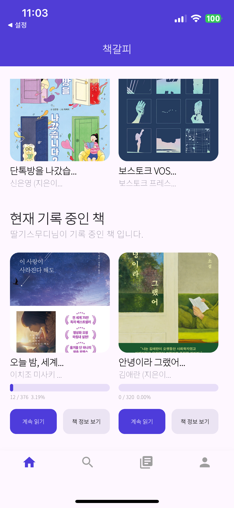
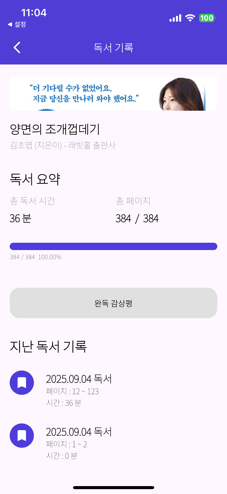

## 🔎 프로젝트 소개  

위 프로젝트는 다음과 같은 배경에서 진행되었습니다.

- 책을 읽으면서 인상 깊었던 문장이나 느낀 점들을 기록하고 싶었지만, 노트나 메모장 앱은 체계적으로 관리하기 어렵다는 불편을 느낌.
- 많은 사람들이 책을 읽고도 기록하지 않아 금방 잊어버리는 경우가 많기 때문에 이를 해결하고자 함. 
- 독서 경험을 ‘나만의 기록’으로 남길 수 있는 공간이 있으면 좋을 것 같음.


<br>

### 1. 프로젝트 기간
 **2025.07.02 ~ 2025.09.04**

<br>

### 2. 포함 내용
1. 프로젝트 소개
2. 사용 기술 스택
3. 서비스 구조,화면,기능
4. 디렉토리 구조 및 패키지 역할
5. API 구조
6. 기술적 이슈 및 해결 과정
7. 관련 논문
8. 프로젝트 팀원 및 역할
   
<br>

## 🔧 사용 기술 스택

### Frontend
- Flutter 3.32.2
 
### Tools
- GitHub
- Figma
- Xcode ios emulator

<br>

## 🚀 서비스 화면 및 기능

### 로그인 및 회원가입 화면
<p align="center">
    
    
</p>

1. 사용자는 이메일, 비밀번호를 이용해 본 서비스에 로그인 할 수 있습니다.
2. 회원가입 버튼을 누르게 되면 회원가입 페이지로 연결되고 사용자는 이곳에서 계정을 생성할 수 있습니다.
3. 계정을 생성할 때는 이메일 인증을 통해 본인 인증 과정을 진행해야 합니다.


<br>

### 이메일 비밀번호 찾기 화면
<p align="center">
    
    
    
    
</p>

1. 사용자는 이름과 휴대폰 번호를 입력하면 해당 번호로 가입한 이메일 계정을 찾을 수 있다.
2. 이메일 계정은 개인 정보 보호를 위해 일부가 마스킹 된 형태로 보여준다.
3. 사용자는 이름을 입력하고, 이메일 인증을 진행하면 비밀번호를 변경할 수 있다.
4. 새 비밀번호를 입력하고 변경 버튼을 누르면 비밀번호가 변경된다.

<br>

### 홈 화면
<p align="center">
    
    
</p>

1. 사용자는 홈 화면에서 이달의 베스트셀러 도서 목록과 신작 도서 목록을 확인할 수 있다.
2. 도서 사진을 누르면 해당 도서에 대한 더 자세한 정보를 확인할 수 있다.
3. 사용자는 현재 기록 중인 책의 목록을 확인할 수 있다.
 - 계속 읽기 버튼을 누르면 독서 기록 페이지로 이동하고, 책 정보 보기 버튼을 누르면 해당 도서에 대한 더 자세한 정보를 확인할 수 있다.

<br>

### 도서 찾기 화면
<p align="center">
    
    
</p>

1. 사용자는 위 페이지에서 원하는 검색어를 입력하여 검색어에 해당하는 도서를 찾을 수 있다. 
2. 도서를 클릭하면 도서 상세 보기 페이지로 이동된다.

<br>

### 기록 독서 리스트 화면


1. 사용자는 해당 페이지에서 현재 기록 중인 독서 리스트를 확인할 수 있다. 클릭할 시 해당 도서 기록 페이지로 이동된다.

<br>

### 마이페이지 화면
<p align="center">
    
    
</p>

1. 사용자는 마이 페이지에서 사용자의 정보를 확인할 수 있다.
2. 프로필 사진을 누르면 프로필 사진으로 지정할 사진을 선택할 수 있고, 저장 메시지에 확인 버튼을 누르면 프로필 사진으로 지정된다.

<br>

### 독서 기록 화면
<p align="center">
    
</p>

1. 사용자는 해당 페이지에서 독서 기록에 관한 정보를 확인할 수 있다.
2. 계속 읽기 버튼을 누르면 독서를 할 수 있는 페이지로 이동된다.

<br>

### 독서 및 기록 화면
<p align="center">
    
    
    
    
</p>

1. 사용자는 해당 페이지에서 독서 활동을 할 수 있다.
2. 독서 활동이 끝나게 되면 몇 페이지부터 몇 페이지 까지 읽었는지 독서 진행 상황을 드롭박스로 선택할 수 있고, 질문에 대한 답변을 통해 오늘 독서에 대한 기록을 할 수 있다.  
3. 모두 기록한 뒤 기록하기 버튼을 누르면 기록이 된다.
4. 독서 활동이 기록되면 마지막 화면과 같이 독서를 한 내용이 반영이 된다.

<br>

### 독서 기록 확인 및 완독 화면
<p align="center">
    
    
    
</p>

1. 사용자는 독서 기록 화면에서 지난 독서에서 기록했던 내용들을 확인할 수 있다.
2. 독서를 완독하게 된다면 위 화면과 같이 완독 감상평이라는 버튼이 생긴다.
3. 완독 감상평 버튼을 누르게 된다면 완독에 대한 감상평을 기록할 수 있고, 기존 독서 기록에 대한 질문들보다 더 다양한 질문들이 있기 때문에 더 깊이 있게 기록을 할 수 있다.

<br>

## 📂 디렉토리 구조 및 패키지 역할
### 디렉토리 구조
```
.
├── api  
│   ├── auth_api.dart
│   ├── book_api.dart
│   ├── book_log_api.dart
│   ├── book_log_question_api.dart
│   ├── book_record_api.dart
│   ├── mail_api.dart
│   ├── member_api.dart
│   └── utils
│       ├── api_basic_util.dart
│       └── dio
│           ├── dio_client.dart
│           └── token_interseptor.dart
├── main.dart
├── models
│   ├── book_log_question.dart
│   ├── book_log.dart
│   ├── book_record.dart
│   ├── book.dart
│   ├── email_response.dart
│   └── member.dart
├── provider
│   ├── auth_provider.dart
│   ├── book_record_provider.dart
│   └── member_provider.dart
├── screens
│   ├── auth
│   │   ├── login_page.dart
│   │   └── signup_page.dart
│   ├── book
│   │   ├── book_detail_page.dart
│   │   └── book_search_page.dart
│   ├── booklog
│   │   ├── book_log_detail_over_page.dart
│   │   └── book_log_detail_page.dart
│   ├── bookrecord
│   │   ├── book_record_list_page.dart
│   │   ├── book_record_over_wirte_page.dart
│   │   ├── book_record_page.dart
│   │   ├── book_record_timer_page.dart
│   │   └── book_record_write_page.dart
│   ├── home
│   │   └── home.dart
│   ├── mypage
│   │   ├── my_page.dart
│   │   └── privacy_terms_page.dart
│   ├── search
│   │   ├── search_email_page.dart
│   │   ├── search_email_result_page.dart
│   │   ├── search_password_page.dart
│   │   └── search_password_result_page.dart
│   └── splash_page.dart
├── utils
│   └── global_util.dart
└── widgets
    ├── app_bars.dart
    ├── bottom_navigation_bar.dart
    ├── custom_dropdown.dart
    ├── custom_filled_button.dart
    ├── custom_snackbar.dart
    ├── custom_text_field.dart
    ├── login_buttons.dart
    └── login_textfield.dart
```
1. api : SpringBoot 서버와 RestAPI 통신을 하는 역할을 수행하는 패키지
2. models : 책, 기록, 사용자와 같이 객체를 class로 관리하는 역할을 수행하는 패키지
3. provider : 일부 model을 전역적으로 사용하고, 상태가 바뀔때 곧바로 반영하기 위한 Provider 역할을 수행하는 패키지
4. screens : 앱의 화면을 그리는 역할을 담당하는 패키지
5. utils : MainColor, MainPadding 과 같이 자주 사용하는 값들을 가져오기 위한 패키지
6. widgets : AppBar, Button과 같이 자주 쓰이는 Widget들을 가져오기 위한 패키지 
7. main.dart : 메인 실행 파일 
 
<br>

## ✅ 기술 적용
1. dio를 활용한 RestAPI 통신 구현 및 RefreshToken 기능 구현
    ```
    Future<List<BookRecord>> getMyBookRecord(BuildContext context) async {
  
        List<BookRecord> result = [];

        final dioClient = Provider.of<DioClient>(context,listen: false);
        
        try {
            final response = await dioClient.dio.get("$base_url/me");

            if (response.statusCode == 200) {
            final bookRecords = response.data;
            for (var bookRecord in bookRecords) {
                result.add(BookRecord.fromJson(bookRecord));
            }
            Provider.of<BookRecordProvider>(context,listen: false).setBookRecords(result);
            return result;
            } 
            return [];
        } on DioException catch (e) {
            print('Dio 오류 발생: ${e.response?.statusCode}');

            return [];
        } catch (e) {
            print('알 수 없는 오류 발생: $e');
            return [];
        }
    }
    ```
- 위 코드는 dio 패키지를 이용해 현재 내 독서 기록 목록을 가져오는 RestAPI 통신 코드
- 200과 같은 정상적인 처리가 되었을 때만 데이터를 받아 처리해주고, 예외가 발생한다면 예외 로그를 발생시키고 빈 리스트를 반환하도록 구현함. 

    <br>

    ```
    @override
    void onError(DioException err, ErrorInterceptorHandler handler) async {
        if (err.response?.statusCode == 401) {
        try {
            await authProvider.clearToken();
            await refreshToken();

            if (authProvider.accessToken != null) {
            err.requestOptions.validateStatus = (status) {
                return true;
            };
            final retryResponse = await dio.fetch(err.requestOptions
                ..headers["Authorization"] = "Bearer ${authProvider.accessToken}");
            
            if (retryResponse.statusCode! >= 200 && retryResponse.statusCode! <= 299) {
                return handler.resolve(retryResponse);
            } else if (retryResponse.statusCode == 401) {
                navigatorKey.currentState?.pushNamedAndRemoveUntil('/login', (route) => false);
            } else {
                return handler.next(DioException(
                requestOptions: err.requestOptions,
                response: retryResponse,
                ));
            }
            }
        } catch (e) {
            print(e);
        }
        }
        return handler.next(err);
    }
    ```
- 위 코드는 dio를 통해 요청을 보낼 때 401 (인증 관련)이라는 응답 상태를 반환받으면 토큰을 재발급 하여주는 코드이다.
- 재발급 했을 때는 200 ~ 299 코드가 온다면 원래 보냈던 요청을 다시 보내고, 다시 401이 온다면 리프레쉬 토큰도 유효하지 않은 상황이므로 예외를 발생시키도록 구현 

<br>

2. JWT 토큰 관리
- FlutterSecureStorage를 통해 안전하게 관리 (각 플랫폼에서 제공하는 OS 레벨의 보안 저장소를 활용)
  1. Android
      - AES로 데이터를 암호화해서 저장하고, 암호화 키는 Keystore(Hardware-backed, 보안 칩에 저장) 안에 보관
  2. ios
      - ios Keychain을 사용, Keychain은 iOS 자체에서 제공하는 보안 저장소로, 기기 PIN/Face ID/Touch ID와 연동되어 보호됨.

<br>

3. 에뮬레이터가 아닌 실제 기기에서 테스트
<p align="center">
    
    
</p>

- ios 기기는 Xcode를 활용하여 유선 연결로 실행
- Android 기기는 apk 배포를 통해 실행 

<br>

## 👬 개인 프로젝트 역할
1. 🐶이세영 [@LSe-Yeong](https://github.com/LSe-Yeong)
    - 전반적인 앱 화면 구현
    - dio 패키지를 활용한 RestAPI 통신 구현
    - Provider를 통해 상태 관리 기능 구현
    

